# SPeST: Spectral Estimation Library


In readme, for usage example I will inspect the popular spectral estimation methods with audio file consists G5 note with trumpet. Each of models will be shown in whole and short-time structure. My personal favorite is Min-Norm method, because it gives Autoregressive parameters and a good Power Spectral Density at the same time.


# Data Load

```matlab:Code
clear; clc; close all;

[x,fs]=audioread('trumpet-G5.wav');
N=size(x,1);
d=size(x,2);
t=fs*((1:N)-1)';

xzm=x-mean(x,1);

x_channel_labels=cell(d,1);
for i=1:d
    x_channel_labels{i}=['Channel ' num2str(i)];
end
```

### Short-time Partitioning


```matlab:Code
partition_count=500;
partition_N=ceil(N/partition_count);
Nnew=partition_count*partition_N;
x_st=[x; zeros(Nnew-N,d)];
x_st=reshape(x_st,[partition_N,partition_count]);
x_st=x_st-mean(x_st,1);

x_stax = [0 Nnew/fs]; %t axis
y_stax = [0 fs/2]; %f axis
```

### Plot Time Series

```matlab:Code
plot(t,x)
ylabel('Amplitude ');
xlabel('Time(Sec)');
legend(x_channel_labels)
grid minor;
```


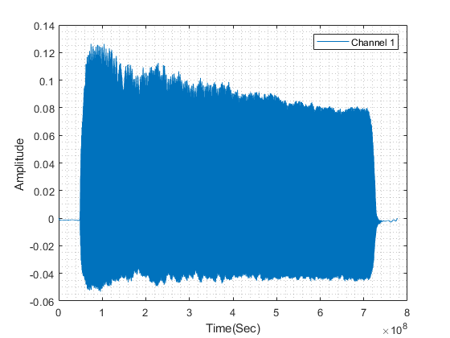

# Spectral Estimation Library

```matlab:Code
spestm_obj=spestm_lib();
spestm_obj.f_range='half';
spestm_obj.window_type='hann';
spestm_obj.x=xzm;
%spestm_obj.x=spestm_obj.side_awgn(20);
spestm_obj.fs=fs;
spestm_obj.p=24;
spestm_obj.q=4;
spestm_obj.M=96;
spestm_obj=spestm_obj.init();
```


```matlab:Code
spestm_obj_st=spestm_lib();
spestm_obj_st.f_range='half';
spestm_obj_st.window_type='hann';
spestm_obj_st.x=x_st;
spestm_obj_st.x=spestm_obj_st.side_awgn(20);
spestm_obj_st.fs=fs;
spestm_obj_st.p=12;
spestm_obj_st.q=2;
spestm_obj_st.M=24;
spestm_obj_st=spestm_obj_st.init();
```

## Periodogram PSD


The most basic one is Periodogram, it's just amplitude spectrum of autocorrelation function 's Fouirer transform.


```matlab:Code
[y_per,f]=spestm_obj.psd_periodogram();
y_per_st=spestm_obj_st.psd_periodogram();
```


```matlab:Code
semilogy(f,y_per);
ylabel('PSD(W/Hz^2) ');
xlabel('Frequency(Hz)');
legend(x_channel_labels)
grid minor;
```


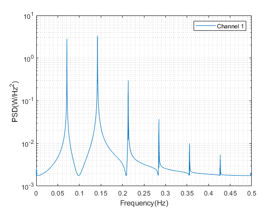


```matlab:Code
image_y=log10(y_per_st);
imagesc(x_stax,y_stax,image_y)
caxis([min(min(image_y)) max(max(image_y))]);
xlabel('Time(sec)')
ylabel('Freq(Hz)')
set(gca,'YDir','normal')
colorbar;
```


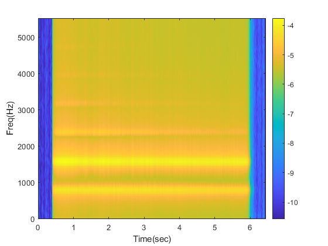

## Blackman-Tukey PSD


It's the variant of Periodogram, but differs in windowing. We window  instead of .


```matlab:Code
[y_bt,f]=spestm_obj.psd_blackmantukey();
y_bt_st=spestm_obj_st.psd_blackmantukey();
```


```matlab:Code
semilogy(f,y_bt);
ylabel('PSD(W/Hz) ');
xlabel('Frequency(Hz)');
legend(x_channel_labels)
grid minor;
```


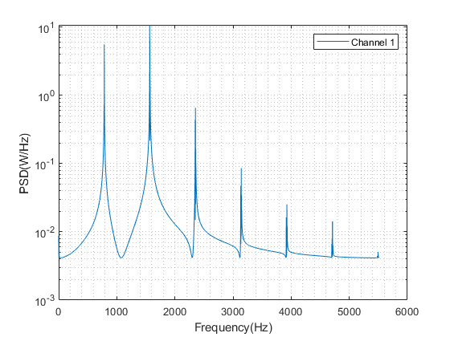


```matlab:Code
image_y=log10(y_bt_st);
imagesc(x_stax,y_stax,image_y)
caxis([min(min(image_y)) max(max(image_y))]);
xlabel('Time(sec)')
ylabel('Freq(Hz)')
set(gca,'YDir','normal')
colorbar;
```


## Capon PSD


From now on, we don't mention about windowing. We will use input signal directly. Capon PSD, is one of the best because of detail parameter . If  increases, details of noisy input signal can be observed clearly; but it has a limit naturally.


```matlab:Code
[y_cap,f]=spestm_obj.psd_capon();
y_cap_st=spestm_obj_st.psd_capon();
```


```matlab:Code
semilogy(f,y_cap);
ylabel('PSD(W/Hz^2) ');
xlabel('Frequency(Hz)');
legend(x_channel_labels)
grid minor;
```


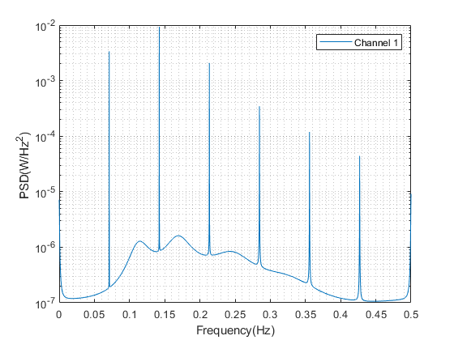


```matlab:Code
image_y=log10(y_cap_st);
imagesc(x_stax,y_stax,image_y)
caxis([min(min(image_y)) max(max(image_y))]);
xlabel('Time(sec)')
ylabel('Freq(Hz)')
set(gca,'YDir','normal')
colorbar;
```


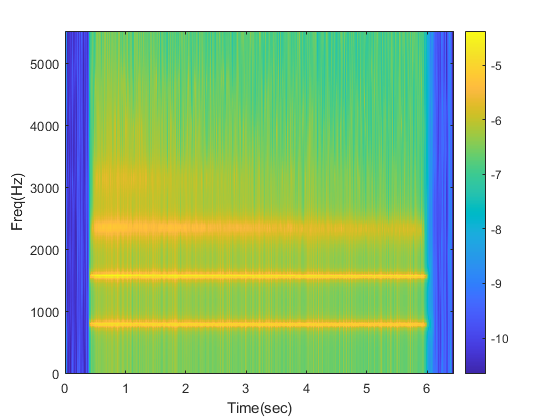

## Autoregressive (Yule-Walker) PSD


Solution of the equation above will give parameter vector .


Parameter  can be obtained by after obtaining parameter vector 


Then using these parameters


 


```matlab:Code
[y_aryw,f] = spestm_obj.psd_aryulewalker();
y_aryw_st=spestm_obj_st.psd_aryulewalker();
```


```matlab:Code
semilogy(f,y_aryw);
ylabel('PSD(W/Hz) ');
xlabel('Frequency(Hz)');
legend(x_channel_labels)
grid minor;
```


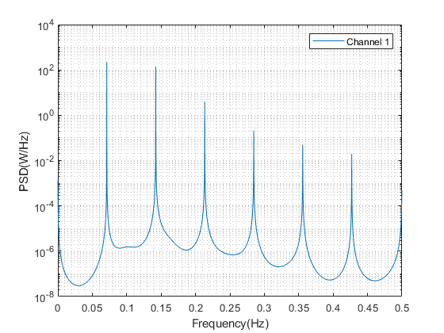


```matlab:Code
image_y=log10(y_aryw_st);
imagesc(x_stax,y_stax,image_y)
caxis([min(min(image_y)) max(max(image_y))]);
xlabel('Time(sec)')
ylabel('Freq(Hz)')
set(gca,'YDir','normal')
colorbar;
```


## Autoregressive (Modified Covariance) PSD

```matlab:Code
[y_armc,f] = spestm_obj.psd_armodcov();
y_armc_st=spestm_obj_st.psd_armodcov();
```


```text:Output
Rank deficient, p is changed to 0
Rank deficient, p is changed to 0
Rank deficient, p is changed to 0
```


```matlab:Code
semilogy(f,y_armc);
ylabel('PSD(W/Hz) ');
xlabel('Frequency(Hz)');
legend(x_channel_labels)
grid minor;
```


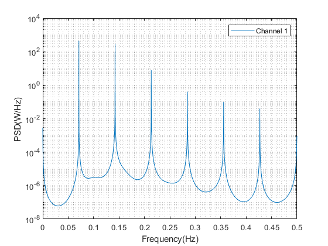


```matlab:Code
image_y=log10(y_armc_st);
imagesc(x_stax,y_stax,image_y)
caxis([min(min(image_y)) max(max(image_y))]);
xlabel('Time(sec)')
ylabel('Freq(Hz)')
set(gca,'YDir','normal')
colorbar;
```


## Autoregressive (Burg) PSD

```matlab:Code
[y_arburg,f]=spestm_obj.psd_arburg();
y_arburg_st=spestm_obj_st.psd_arburg();
```


```matlab:Code
semilogy(f,y_arburg);
ylabel('PSD(W/Hz^2) ');
xlabel('Frequency(Hz)');
legend(x_channel_labels)
grid minor;
```


```matlab:Code
image_y=log10(y_arburg_st);
imagesc(x_stax,y_stax,image_y)
caxis([min(min(image_y)) max(max(image_y))]);
xlabel('Time(sec)')
ylabel('Freq(Hz)')
set(gca,'YDir','normal')
colorbar;
```


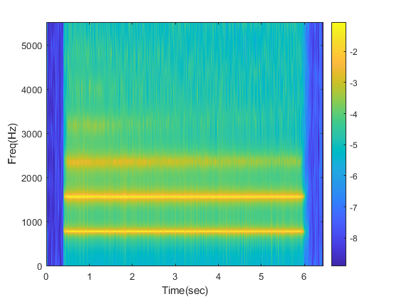

## Autoregressive Moving Average PSD


Solution of the equation above will give parameter vector .


Filtering input signal  with parameter vector 


Find parameter vector  for   with Yule-Walker equations


Solution of the equation above will give parameter vector .


  


 


```matlab:Code
[y_arma,f]=spestm_obj.psd_arma();
y_arma_st=spestm_obj_st.psd_arma();
```


```matlab:Code
semilogy(f,y_arma);
ylabel('PSD(W/Hz^2) ');
xlabel('Frequency(Hz)');
legend(x_channel_labels)
grid minor;
```


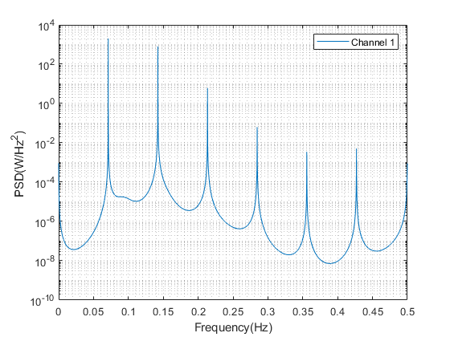


```matlab:Code
image_y=log10(y_arma_st);
imagesc(x_stax,y_stax,image_y)
caxis([min(min(image_y)) max(max(image_y))]);
xlabel('Time(sec)')
ylabel('Freq(Hz)')
set(gca,'YDir','normal')
colorbar;
```


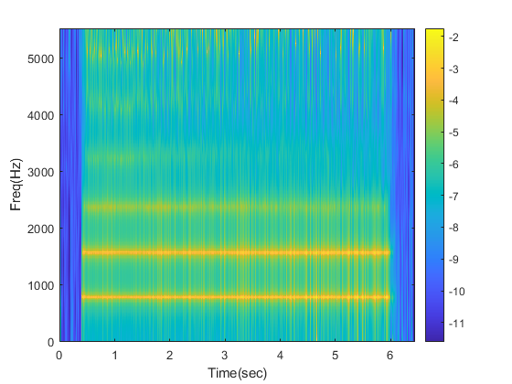

## MUSIC PSD

```matlab:Code
[y_music,f] = spestm_obj.psd_music();
y_music_st=spestm_obj_st.psd_music();
```


```matlab:Code
semilogy(f,y_music);
ylabel('PSD(W/Hz) ');
xlabel('Frequency(Hz)');
legend(x_channel_labels)
grid minor;
```


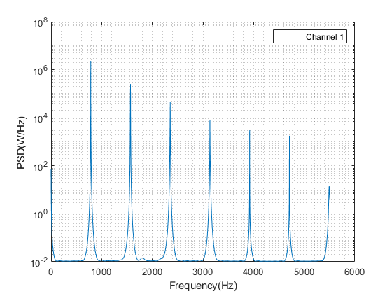


```matlab:Code
image_y=log10(y_music_st);
imagesc(x_stax,y_stax,image_y)
caxis([min(min(image_y)) max(max(image_y))]);
xlabel('Time(sec)')
ylabel('Freq(Hz)')
set(gca,'YDir','normal')
colorbar;
```


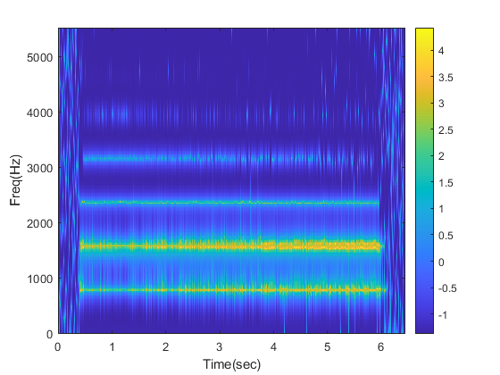

## Min-Norm PSD

```matlab:Code
[y_minnorm,f]=spestm_obj.psd_minnorm();
y_minnorm_st=spestm_obj_st.psd_minnorm();
```


```matlab:Code
semilogy(f,y_minnorm);
ylabel('PSD(W/Hz) ');
xlabel('Frequency(Hz)');
legend(x_channel_labels)
grid minor;
```


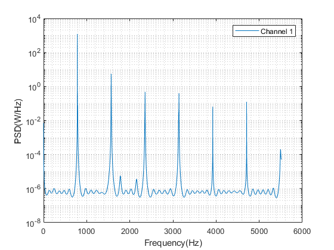


```matlab:Code
image_y=log10(y_minnorm_st);
imagesc(x_stax,y_stax,image_y)
caxis([min(min(image_y)) max(max(image_y))]);
xlabel('Time(sec)')
ylabel('Freq(Hz)')
set(gca,'YDir','normal')
colorbar;
```


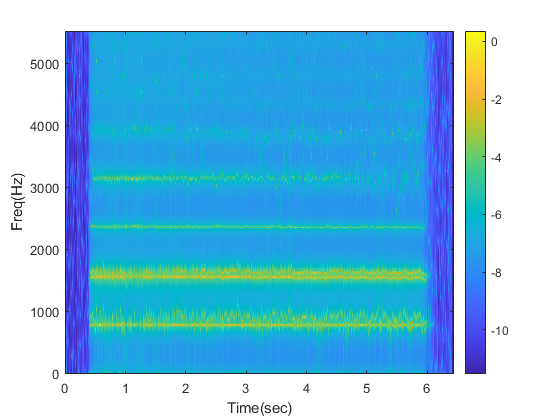

# Comparison of All PSDs

```matlab:Code
lw=1.2;
sep='--';

semilogy(f,y_per,sep,'linewidth',lw); hold on;
plot(f,y_bt,sep,'linewidth',lw)
plot(f,y_cap,sep,'linewidth',lw)
plot(f,y_aryw,sep,'linewidth',lw)
plot(f,y_armc,sep,'linewidth',lw)
plot(f,y_arburg,sep,'linewidth',lw)
plot(f,y_arma,sep,'linewidth',lw)
plot(f,y_music,sep,'linewidth',lw)
plot(f,y_minnorm,sep,'linewidth',lw)
ylabel('PSD(W/Hz) ');
xlabel('Frequency(Hz)');
legend('Periodogram', 'Blackman-Tukey', 'Capon', 'AR Yule-Walker', 'AR Modified Covariance' ...
    , 'AR Burg', 'ARMA', 'MUSIC', 'Min-Norm','Location','best')
grid on;
```


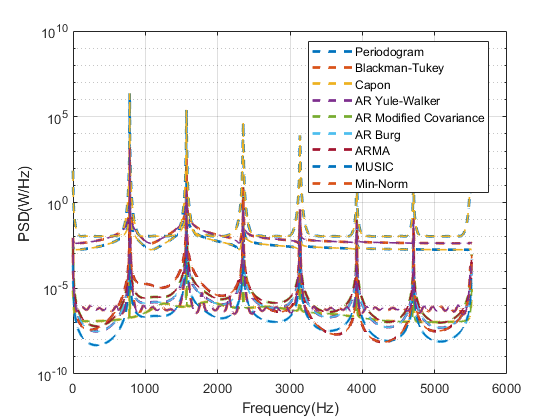

