# SPeSTM: Spectral Estimation Library

SPeSTM is a small MATLAB class (`spestm_lib`) that collects the most common
power-spectral-density (PSD) estimators behind a single, uniform interface. You
configure one object with your signal and a few model orders, call `init()`,
and then ask it for whichever estimate you need. Every estimator returns the PSD
together with its frequency axis in Hz.

## Implemented estimators

| Method | Call | Family |
| --- | --- | --- |
| Periodogram | `psd_periodogram` | Non-parametric |
| Blackman–Tukey | `psd_blackmantukey` | Non-parametric |
| Capon (minimum variance) | `psd_capon` | Filter-bank |
| Autoregressive – Yule-Walker | `psd_aryulewalker` | Parametric (AR) |
| Autoregressive – Modified Covariance | `psd_armodcov` | Parametric (AR) |
| Autoregressive – Burg | `psd_arburg` | Parametric (AR) |
| Autoregressive Moving Average | `psd_arma` | Parametric (ARMA) |
| MUSIC | `psd_music` | Subspace |
| Min-Norm | `psd_minnorm` | Subspace |

## Requirements

- MATLAB (developed and tested with R2023b)
- Signal Processing Toolbox (uses `window`, `xcorr`, and `arburg`)

## Repository contents

- `spestm_lib.m` — the estimator library (the `spestm_lib` class).
- `main.mlx` — the MATLAB Live Script this README is generated from.
- `trumpet-G5.wav` — example audio (a G5 note played on a trumpet).
- `readme_images/` — figures used in this document.

## Quick start

```matlab
[x,fs] = audioread('trumpet-G5.wav');

obj = spestm_lib();
obj.x = x - mean(x,1);   % input, size [N, d] (one column per channel)
obj.fs = fs;             % sample rate
obj.f_range = 'half';    % 'half' for [0, fs/2] or 'full' for [0, fs]
obj.window_type = 'hann';
obj.p = 24;              % AR order
obj.q = 4;               % MA order
obj.M = 96;              % subspace size
obj = obj.init();        % must be called after setting properties

[psd, f] = obj.psd_minnorm();   % f is in Hz
semilogy(f, psd);
```

## Properties

| Property | Default | Meaning |
| --- | --- | --- |
| `x` | `[]` | Input signal, size `[N, d]` (`d` channels processed independently). |
| `fs` | `[]` | Sample rate; if empty, `init()` sets it to `1/N`. |
| `p` | `12` | AR order / lower noise-subspace eigenvector limit. |
| `q` | `2` | MA order. |
| `g` | `2` | Capon model order. |
| `M` | `[]` | Upper noise-subspace eigenvector limit; if empty, set to `N`. |
| `Nf` | `[]` | Number of frequency points; if empty, `2^nextpow2(N)`. |
| `window_type` | `'rectwin'` | Any [`window`](https://www.mathworks.com/help/signal/ref/window.html) name. |
| `f_range` | `'full'` | `'full'` for `[0, fs]` or `'half'` for `[0, fs/2]`. |

> Set the properties first, then call `init()` — it derives `N`, `d`, the
> frequency axis, and the steering-vector matrix from them.

---

The rest of this document is a worked tutorial. It inspects the popular spectral
estimation methods on the example audio (a G5 note on a trumpet), showing each
model in both whole-signal and short-time form. My personal favorite is the
Min-Norm method, because it gives the autoregressive parameters and a good Power
Spectral Density at the same time.

# Data Load

```matlab:Code
clear; clc; close all;

[x,fs]=audioread('trumpet-G5.wav');
N=size(x,1);
d=size(x,2);
t=fs*((1:N)-1)';

xzm=x-mean(x,1);

x_channel_labels=cell(d,1);
for i=1:d
    x_channel_labels{i}=['Channel ' num2str(i)];
end
```

### Short-time Partitioning

$$
\begin{aligned}
N_\text{partition} &= \left\lceil \frac{N}{N_\text{count}} \right\rceil, \qquad N_\text{new} = N_\text{count} \cdot N_\text{partition} \\
x_\text{new} &= \begin{bmatrix} x & \mathbf{0}_{(N_\text{new}-N)\times d} \end{bmatrix} \\
x_\text{shorttime} &= \operatorname{reshape}\!\left( x_\text{new},\ [\,N_\text{partition},\ N_\text{count}\,] \right)
\end{aligned}
$$


```matlab:Code
partition_count=500;
partition_N=ceil(N/partition_count);
Nnew=partition_count*partition_N;
x_st=[x; zeros(Nnew-N,d)];
x_st=reshape(x_st,[partition_N,partition_count]);
x_st=x_st-mean(x_st,1);

x_stax = [0 Nnew/fs]; %t axis
y_stax = [0 fs/2]; %f axis
```

### Plot Time Series

```matlab:Code
plot(t,x)
ylabel('Amplitude ');
xlabel('Time(Sec)');
legend(x_channel_labels)
grid minor;
```


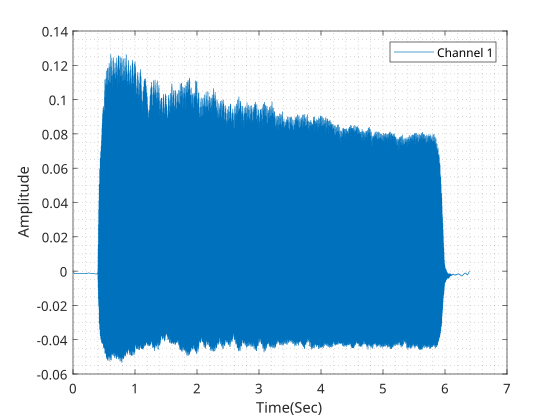

# Spectral Estimation Library

```matlab:Code
spestm_obj=spestm_lib();
spestm_obj.f_range='half';
spestm_obj.window_type='hann';
spestm_obj.x=xzm;
%spestm_obj.x=spestm_obj.side_awgn(20);
spestm_obj.fs=fs;
spestm_obj.p=24;
spestm_obj.q=4;
spestm_obj.M=96;
spestm_obj=spestm_obj.init();
```


```matlab:Code
spestm_obj_st=spestm_lib();
spestm_obj_st.f_range='half';
spestm_obj_st.window_type='hann';
spestm_obj_st.x=x_st;
spestm_obj_st.x=spestm_obj_st.side_awgn(20);
spestm_obj_st.fs=fs;
spestm_obj_st.p=12;
spestm_obj_st.q=2;
spestm_obj_st.M=24;
spestm_obj_st=spestm_obj_st.init();
```

## Periodogram PSD


The most basic one is Periodogram, it's just amplitude spectrum of autocorrelation function $`r_X[k]`$'s Fourier transform.


$$x_w[n] = w[n]\,x[n]$$


$$r_X[k] = \frac{1}{f_s} \sum_{n=0}^{N-1} x_w[n]\,\overline{x_w}[n-k]$$


$$P_X^\text{per}(f) = \left| \sum_{k=0}^{N-1} r_X[k]\, e^{-j2\pi \frac{f}{f_s} k} \right|$$


```matlab:Code
[y_per,f]=spestm_obj.psd_periodogram();
y_per_st=spestm_obj_st.psd_periodogram();
```


```matlab:Code
semilogy(f,y_per);
ylabel('PSD(W/Hz^2) ');
xlabel('Frequency(Hz)');
legend(x_channel_labels)
grid minor;
```


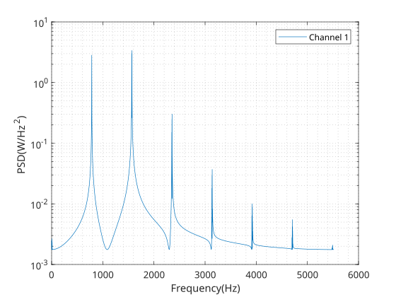


```matlab:Code
image_y=log10(y_per_st);
imagesc(x_stax,y_stax,image_y)
caxis([min(min(image_y)) max(max(image_y))]);
xlabel('Time(sec)')
ylabel('Freq(Hz)')
set(gca,'YDir','normal')
colorbar;
```


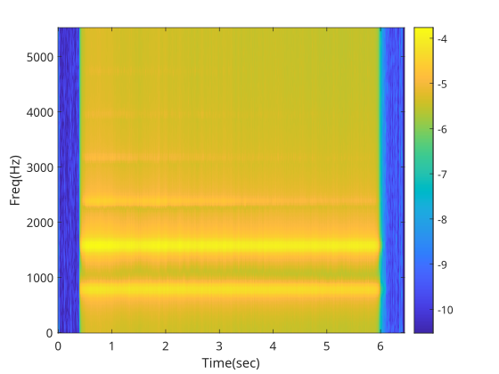

## Blackman-Tukey PSD


It's the variant of Periodogram, but differs in windowing. We window $`r_X[k]`$ instead of $`x[n]`$.


$$r_X[k] = \frac{1}{f_s} \sum_{n=0}^{N-1} x[n]\,\overline{x}[n-k]$$


$$r_{X_w}[k] = w[k]\, r_X[k]$$


$$P_X^\text{bt}(f) = \left| \sum_{k=0}^{N-1} r_{X_w}[k]\, e^{-j2\pi \frac{f}{f_s} k} \right|$$


```matlab:Code
[y_bt,f]=spestm_obj.psd_blackmantukey();
y_bt_st=spestm_obj_st.psd_blackmantukey();
```


```matlab:Code
semilogy(f,y_bt);
ylabel('PSD(W/Hz) ');
xlabel('Frequency(Hz)');
legend(x_channel_labels)
grid minor;
```


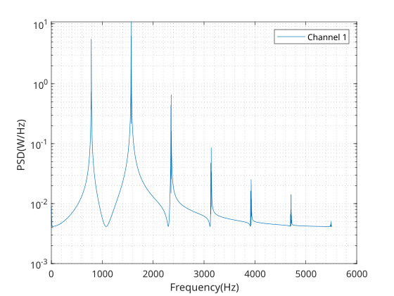


```matlab:Code
image_y=log10(y_bt_st);
imagesc(x_stax,y_stax,image_y)
caxis([min(min(image_y)) max(max(image_y))]);
xlabel('Time(sec)')
ylabel('Freq(Hz)')
set(gca,'YDir','normal')
colorbar;
```


## Capon PSD


From now on, we don't mention about windowing. We will use input signal directly. Capon PSD, is one of the best because of detail parameter $`g`$. If $`g`$ increases, details of noisy input signal can be observed clearly; but it has a limit naturally.


$$r_X[k] = \frac{1}{f_s} \sum_{n=0}^{N-1} x[n]\,\overline{x}[n-k]$$


$$
R_X = \begin{bmatrix}
r_X[0] & r_X[-1] & \cdots & r_X[-(p-1)] \\
r_X[1] & r_X[0] & \cdots & r_X[-(p-2)] \\
\vdots & \vdots & \ddots & \vdots \\
r_X[p-1] & r_X[p-2] & \cdots & r_X[0]
\end{bmatrix}
$$


$$\mathbf{e}_\text{vect} = \begin{bmatrix} 1 & e^{-j2\pi f} & \cdots & e^{-j2\pi f(p-1)} \end{bmatrix}^T$$


$$P_X^\text{capon}(f) = \left| \frac{\mathbf{e}_\text{vect}^{T}\, R_X^{-(g-1)}\, \mathbf{e}_\text{vect}}{\mathbf{e}_\text{vect}^{T}\, R_X^{-g}\, \mathbf{e}_\text{vect}} \right|$$


```matlab:Code
[y_cap,f]=spestm_obj.psd_capon();
y_cap_st=spestm_obj_st.psd_capon();
```


```matlab:Code
semilogy(f,y_cap);
ylabel('PSD(W/Hz^2) ');
xlabel('Frequency(Hz)');
legend(x_channel_labels)
grid minor;
```


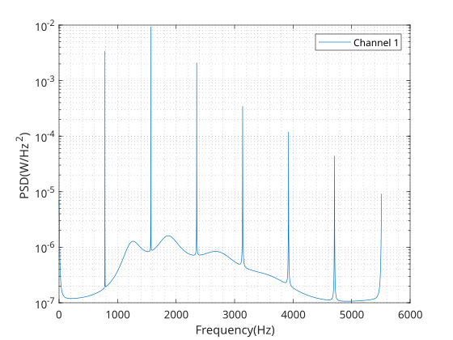


```matlab:Code
image_y=log10(y_cap_st);
imagesc(x_stax,y_stax,image_y)
caxis([min(min(image_y)) max(max(image_y))]);
xlabel('Time(sec)')
ylabel('Freq(Hz)')
set(gca,'YDir','normal')
colorbar;
```


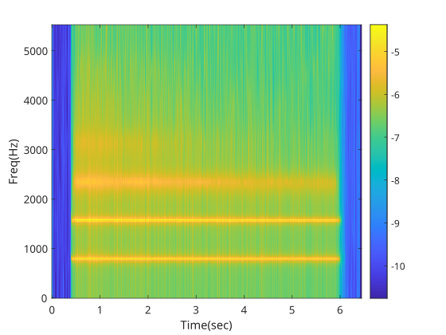

## Autoregressive (Yule-Walker) PSD

$$r_X[k] = \frac{1}{f_s} \sum_{n=0}^{N-1} x[n]\,\overline{x}[n-k]$$


$$
R_X = \begin{bmatrix}
r_X[0] & r_X[-1] & \cdots & r_X[-(p-1)] \\
r_X[1] & r_X[0] & \cdots & r_X[-(p-2)] \\
\vdots & \vdots & \ddots & \vdots \\
r_X[p-1] & r_X[p-2] & \cdots & r_X[0]
\end{bmatrix}
$$


Solution of the equation above will give parameter vector $`a`$.


$$
\begin{bmatrix}
r_X[0] & r_X[-1] & \cdots & r_X[-(p-1)] \\
r_X[1] & r_X[0] & \cdots & r_X[-(p-2)] \\
\vdots & \vdots & \ddots & \vdots \\
r_X[p-1] & r_X[p-2] & \cdots & r_X[0]
\end{bmatrix}
\begin{bmatrix} a[1] \\ a[2] \\ \vdots \\ a[p] \end{bmatrix}
= -\begin{bmatrix} r_X[1] \\ r_X[2] \\ \vdots \\ r_X[p] \end{bmatrix}
$$


Parameter $`\sigma^2`$ can be obtained by after obtaining parameter vector $`\mathbf{a} = \begin{bmatrix} 1 & a[1] & \cdots & a[p] \end{bmatrix}^T`$


$$
\begin{bmatrix}
r_X[0] & r_X[-1] & \cdots & r_X[-p] \\
r_X[1] & r_X[0] & \cdots & r_X[-(p-1)] \\
\vdots & \vdots & \ddots & \vdots \\
r_X[p] & r_X[p-1] & \cdots & r_X[0]
\end{bmatrix}
\begin{bmatrix} 1 \\ a[1] \\ \vdots \\ a[p] \end{bmatrix}
= \begin{bmatrix} \sigma^2 \\ 0 \\ \vdots \\ 0 \end{bmatrix}
$$


Then using these parameters


$$P_X^\text{ARyw}(f) = \frac{\sigma^2}{\left| \mathbf{e}_\text{vect}^{T} \mathbf{a} \right|^2}$$


$$\mathbf{e}_\text{vect} = \begin{bmatrix} 1 & e^{-j2\pi f} & \cdots & e^{-j2\pi f p} \end{bmatrix}^T$$ 


```matlab:Code
[y_aryw,f] = spestm_obj.psd_aryulewalker();
y_aryw_st=spestm_obj_st.psd_aryulewalker();
```


```matlab:Code
semilogy(f,y_aryw);
ylabel('PSD(W/Hz) ');
xlabel('Frequency(Hz)');
legend(x_channel_labels)
grid minor;
```


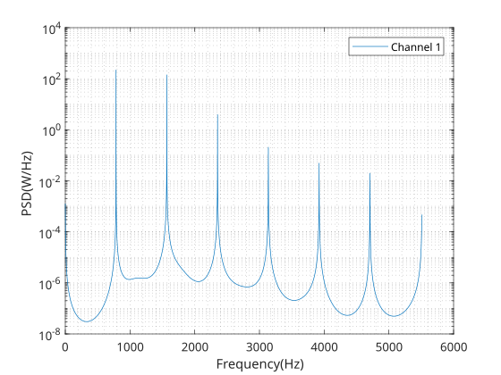


```matlab:Code
image_y=log10(y_aryw_st);
imagesc(x_stax,y_stax,image_y)
caxis([min(min(image_y)) max(max(image_y))]);
xlabel('Time(sec)')
ylabel('Freq(Hz)')
set(gca,'YDir','normal')
colorbar;
```


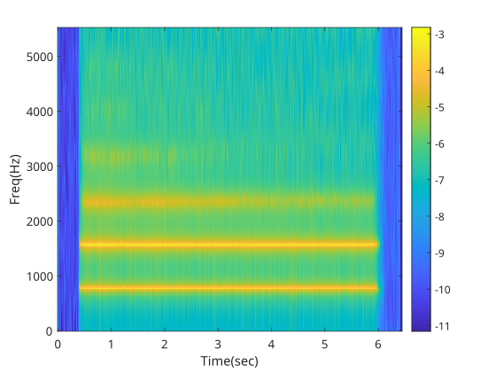

## Autoregressive (Modified Covariance) PSD

```matlab:Code
[y_armc,f] = spestm_obj.psd_armodcov();
y_armc_st=spestm_obj_st.psd_armodcov();
```


```text:Output
Rank deficient, p is changed to 0
Rank deficient, p is changed to 0
Rank deficient, p is changed to 0
```


```matlab:Code
semilogy(f,y_armc);
ylabel('PSD(W/Hz) ');
xlabel('Frequency(Hz)');
legend(x_channel_labels)
grid minor;
```


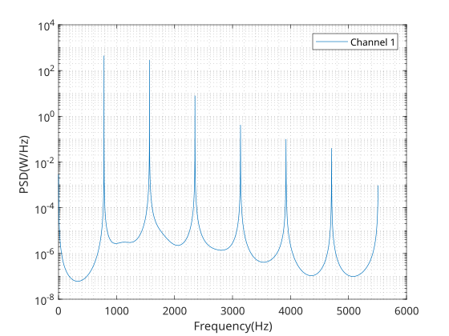


```matlab:Code
image_y=log10(y_armc_st);
imagesc(x_stax,y_stax,image_y)
caxis([min(min(image_y)) max(max(image_y))]);
xlabel('Time(sec)')
ylabel('Freq(Hz)')
set(gca,'YDir','normal')
colorbar;
```


## Autoregressive (Burg) PSD

```matlab:Code
[y_arburg,f]=spestm_obj.psd_arburg();
y_arburg_st=spestm_obj_st.psd_arburg();
```


```matlab:Code
semilogy(f,y_arburg);
ylabel('PSD(W/Hz^2) ');
xlabel('Frequency(Hz)');
legend(x_channel_labels)
grid minor;
```


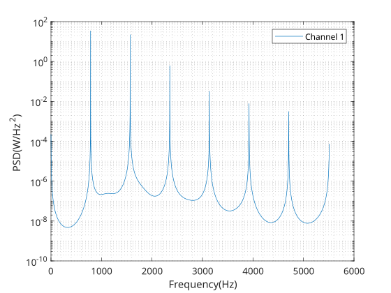


```matlab:Code
image_y=log10(y_arburg_st);
imagesc(x_stax,y_stax,image_y)
caxis([min(min(image_y)) max(max(image_y))]);
xlabel('Time(sec)')
ylabel('Freq(Hz)')
set(gca,'YDir','normal')
colorbar;
```


## Autoregressive Moving Average PSD

$$r_X[k] = \frac{1}{f_s} \sum_{n=0}^{N-1} x[n]\,\overline{x}[n-k]$$


$$
R_X^\text{modified} = \begin{bmatrix}
r_X[q+1] & r_X[q] & \cdots & r_X[q-(p-2)] \\
r_X[q+2] & r_X[q+1] & \cdots & r_X[q-(p-3)] \\
\vdots & \vdots & \ddots & \vdots \\
r_X[q+p] & r_X[q+p-1] & \cdots & r_X[q+1]
\end{bmatrix}
$$


Solution of the equation above will give parameter vector $`a`$.


$$
R_X^\text{modified}
\begin{bmatrix} a[1] \\ a[2] \\ \vdots \\ a[p] \end{bmatrix}
= -\begin{bmatrix} r_X[q+2] \\ r_X[q+3] \\ \vdots \\ r_X[q+p+1] \end{bmatrix}
$$


Filtering input signal $`x`$ with parameter vector $`\mathbf{a} = \begin{bmatrix} 1 & a[1] & \cdots & a[p] \end{bmatrix}^T`$


$$x_f[n] = \sum_{k=0}^{p} a[k]\, x[n-k]$$


Find parameter vector $`\mathbf{a}_f = \begin{bmatrix} 1 & a_f[1] & \cdots & a_f[p] \end{bmatrix}^T`$ for  $`x_f[n]`$ with Yule-Walker equations


Solution of the equation above will give parameter vector $`\mathbf{b}`$.


$$
\begin{bmatrix}
a_f[0] & a_f[1] & \cdots & a_f[-(q-1)] \\
a_f[1] & a_f[0] & \cdots & a_f[-(q-2)] \\
\vdots & \vdots & \ddots & \vdots \\
a_f[q-1] & a_f[q-2] & \cdots & a_f[0]
\end{bmatrix}
\begin{bmatrix} b[1] \\ b[2] \\ \vdots \\ b[q] \end{bmatrix}
= -\begin{bmatrix} a_f[1] \\ a_f[2] \\ \vdots \\ a_f[q] \end{bmatrix}
$$

  

$$P_X^\text{ARMA}(f) = \sigma^2\, \frac{\left| (\mathbf{e}_\text{vect}^{b})^{T} \mathbf{b} \right|^2}{\left| (\mathbf{e}_\text{vect}^{a})^{T} \mathbf{a} \right|^2}$$


$$\mathbf{e}_\text{vect}^{a} = \begin{bmatrix} 1 & e^{-j2\pi f} & \cdots & e^{-j2\pi f p} \end{bmatrix}^T$$ 


$$\mathbf{e}_\text{vect}^{b} = \begin{bmatrix} 1 & e^{-j2\pi f} & \cdots & e^{-j2\pi f q} \end{bmatrix}^T$$


```matlab:Code
[y_arma,f]=spestm_obj.psd_arma();
y_arma_st=spestm_obj_st.psd_arma();
```


```matlab:Code
semilogy(f,y_arma);
ylabel('PSD(W/Hz^2) ');
xlabel('Frequency(Hz)');
legend(x_channel_labels)
grid minor;
```


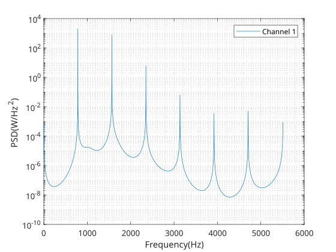


```matlab:Code
image_y=log10(y_arma_st);
imagesc(x_stax,y_stax,image_y)
caxis([min(min(image_y)) max(max(image_y))]);
xlabel('Time(sec)')
ylabel('Freq(Hz)')
set(gca,'YDir','normal')
colorbar;
```


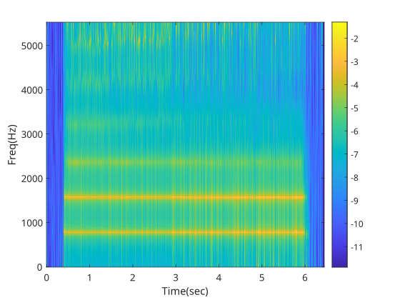

## MUSIC PSD

```matlab:Code
[y_music,f] = spestm_obj.psd_music();
y_music_st=spestm_obj_st.psd_music();
```


```matlab:Code
semilogy(f,y_music);
ylabel('PSD(W/Hz) ');
xlabel('Frequency(Hz)');
legend(x_channel_labels)
grid minor;
```


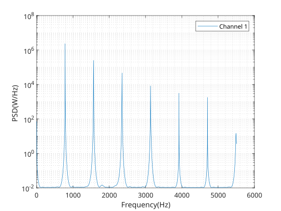


```matlab:Code
image_y=log10(y_music_st);
imagesc(x_stax,y_stax,image_y)
caxis([min(min(image_y)) max(max(image_y))]);
xlabel('Time(sec)')
ylabel('Freq(Hz)')
set(gca,'YDir','normal')
colorbar;
```


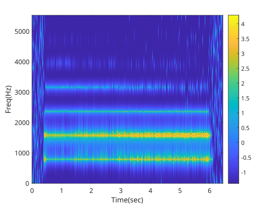

## Min-Norm PSD

```matlab:Code
[y_minnorm,f]=spestm_obj.psd_minnorm();
y_minnorm_st=spestm_obj_st.psd_minnorm();
```


```matlab:Code
semilogy(f,y_minnorm);
ylabel('PSD(W/Hz) ');
xlabel('Frequency(Hz)');
legend(x_channel_labels)
grid minor;
```


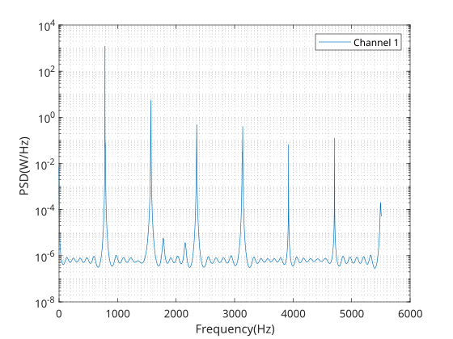


```matlab:Code
image_y=log10(y_minnorm_st);
imagesc(x_stax,y_stax,image_y)
caxis([min(min(image_y)) max(max(image_y))]);
xlabel('Time(sec)')
ylabel('Freq(Hz)')
set(gca,'YDir','normal')
colorbar;
```


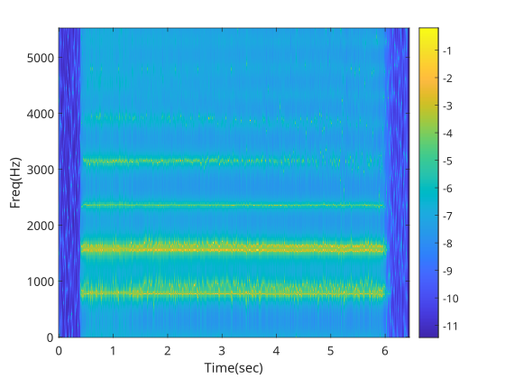

# Comparison of All PSDs

```matlab:Code
lw=1.2;
sep='--';

semilogy(f,y_per,sep,'linewidth',lw); hold on;
plot(f,y_bt,sep,'linewidth',lw)
plot(f,y_cap,sep,'linewidth',lw)
plot(f,y_aryw,sep,'linewidth',lw)
plot(f,y_armc,sep,'linewidth',lw)
plot(f,y_arburg,sep,'linewidth',lw)
plot(f,y_arma,sep,'linewidth',lw)
plot(f,y_music,sep,'linewidth',lw)
plot(f,y_minnorm,sep,'linewidth',lw)
ylabel('PSD(W/Hz) ');
xlabel('Frequency(Hz)');
legend('Periodogram', 'Blackman-Tukey', 'Capon', 'AR Yule-Walker', 'AR Modified Covariance' ...
    , 'AR Burg', 'ARMA', 'MUSIC', 'Min-Norm','Location','best')
grid on;
```


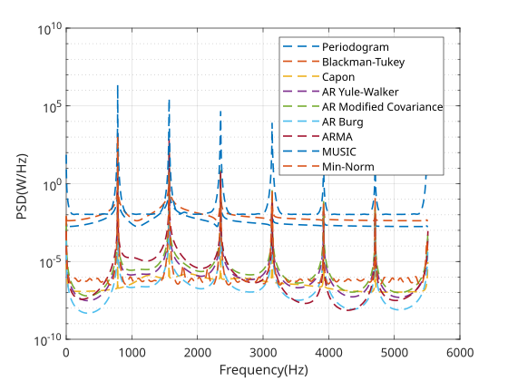

# License

This project is licensed under the GNU General Public License v3.0. See the
[LICENSE](LICENSE) file for details.

